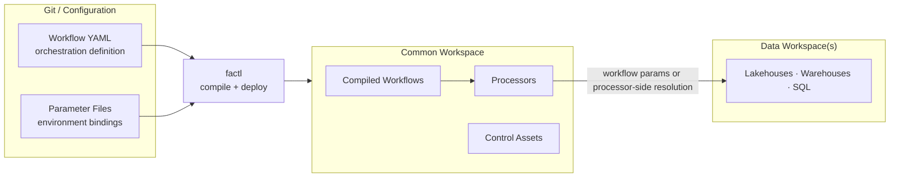
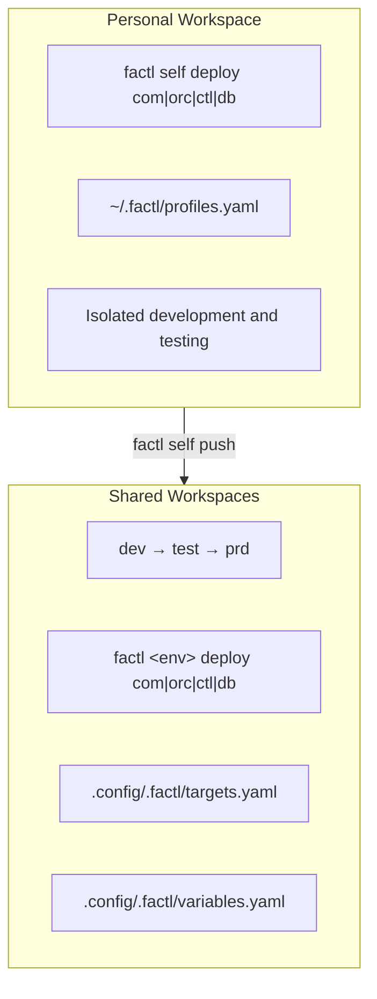

# Architecture

How factl compiles declarative workflow definitions into Fabric DataPipelines and deploys them to the common workspace.

## Core concepts

### Processors

A **processor** is a reusable Fabric item — typically a Notebook or DataPipeline. Processors are deployed once to the workspace folder configured by `deployment.orchestration.processor.workspace_folder` in `project.yaml` and referenced by name in any number of workflows.

Processors carry no environment-specific logic. That logic is supplied per workflow through **params**:

```yaml
processors:
  - name: "NB_IngestNoaaWeatherToBronze"
    alias: "ingest_weather"
    params:
      env:
        value: "{{ env_name }}"
        type: "string"
      start_date:
        value: "2024-01-01"
        type: "string"
```

The processor notebook reads `start_date` as a parameter. The workflow YAML sets it. The same processor can be used in multiple workflows with different parameter values.

### Workflows

A **workflow** is a YAML file under the directory configured by `deployment.orchestration.workflow.control_folder` in `project.yaml` (relative to `deployment.control.local_path`) that declares:

* **Processors** — what runs (by name reference)
* **Dependencies** — run order between processors
* **Schedules** — when the workflow runs
* **Parameters** — values passed to each processor

Each workflow compiles into a single Fabric DataPipeline.

### Schedules

Schedules are defined in the same YAML file as the workflow:

```yaml
schedules:
  - enabled: false
    cron_expression: "0 6 * * *"
```

The framework auto-converts cron expressions to Fabric-native schedule types (`cron`, `daily`, `weekly`, `monthly`). Schedules can be force-disabled per environment using `force_disable_schedules` in `targets.yaml`.

## Compilation pipeline


### Template system

Built-in Jinja2 templates define the Fabric DataPipeline activity structure:

| Template | Purpose |
|---|---|
| `start.json` | Pipeline start activity (entry point) |
| `Notebook.json` | TridentNotebook activity for notebook processors |
| `DataPipeline.json` | ExecutePipeline activity for pipeline processors |
| `end.json` | Pipeline end activity (terminal point) |

Custom templates can override the built-in ones. Set `deployment.orchestration.workflow.template.path` in `project.yaml` to a directory containing your custom `.json` template files.

### Jinja2 variables

Templates have access to built-in variables and user-defined variables:

**Built-in (provided automatically):**
* `workspace_id` — target common workspace GUID (set automatically from profile or target config)
* `item_id` — item GUID
* `item_name` — item display name
* `item_type` — Fabric item type
* `processor_name` — processor name from workflow YAML
* `processor_alias` — alias from workflow YAML
* `workflow_name` — workflow display name

**User-defined (from variables.yaml):**
* Any variable under `targets.<env>` in `.config/.factl/variables.yaml`

## Workspace topology

factl expects a two-workspace layout per environment:

**Common workspace** — the workspace factl deploys to (`com_workspace_id` in `targets.yaml`). Contains:
- Processors (Notebooks, DataPipelines) deployed to the folder configured by `deployment.orchestration.processor.workspace_folder` in `project.yaml`
- Compiled workflow DataPipelines deployed to the folder configured by `deployment.orchestration.workflow.workspace_folder` in `project.yaml`
- Common Fabric items (Environments, Spark Job Definitions, etc.)
- The control Lakehouse (configured by `deployment.common.control.lakehouse.name` in `project.yaml`) holding dbt models, profiles, and configuration files

**Data workspace(s)** — where medallion Lakehouses, Warehouses, SQL databases, and other analytical data stores live. factl does **not** deploy to these workspaces. Instead, environment-specific targets are resolved in two common ways:
- Pass environment-specific values through workflow `params` — workspace IDs, lakehouse IDs, item names, endpoints, database names, or other connection settings
- Pass a higher-level selector such as `env` and let the processor resolve the correct data store internally (e.g. connect to the dev store when `env=dev`)
- Parameter files (configured by `deployment.common.parameter_path` and `deployment.orchestration.parameter_path` in `project.yaml`) substitute environment-specific values at deploy time



Separating data from orchestration improves security isolation, lifecycle independence, and blast-radius containment. Processors run in the common workspace but read and write data workspaces via cross-workspace OneLake references.

## Deployment types

factl manages four categories of Fabric artifacts:

| Type | Source | Destination | Command |
|---|---|---|---|
| **Common** | Configured by `deployment.common.local_path` in `project.yaml` | Common workspace root (via fabric-cicd) | `deploy com` |
| **Orchestration** | Workflow YAML (compiled) + processor items | Common workspace (deployed to the folders configured by `deployment.orchestration.workflow.workspace_folder` and `deployment.orchestration.processor.workspace_folder`) | `deploy orc` |
| **Control** | Configured by `deployment.control.local_path` in `project.yaml` (control assets) | Control Lakehouse in the common workspace (configured by `deployment.common.control.lakehouse.name` in `project.yaml`, via OneLake fsspec) | `deploy ctl` |
| **Database** | Configured by `deployment.database.local_path` in `project.yaml` (SQL scripts) | Metadata SQL database | `deploy db` |

### Common deployment

Uses the fabric-cicd SDK to publish items from a local directory to the common workspace. Supports:

* Git-based deployment (connect workspace to a repo branch, update from Git)
* Parameter replacement (Lakehouse IDs, workspace IDs per environment)
* Item type filtering (include/exclude specific Fabric item types)
* Orphan item cleanup

### Orchestration deployment

Compiles workflow YAML into Fabric DataPipeline JSON, writes the compiled output to a temporary directory, then publishes it via fabric-cicd. Also deploys processor items referenced by the workflows.

### Control deployment

Uploads files from the directory configured by `deployment.control.local_path` in `project.yaml` to the control Lakehouse (configured by `deployment.common.control.lakehouse.name` in `project.yaml`) in the common workspace using the OneLake file system API (fsspec). Supports dry-run mode (`--dry-run`) to preview changes.

### Database deployment

Executes SQL scripts from the directory configured by `deployment.database.local_path` in `project.yaml` against a metadata SQL database. Uses mssql-python for connections. Supports include filtering.

## Environment model



### Personal workspace flow

1. `factl self pull <branch>` — pulls a Git branch into your personal workspace (connects workspace to Git, updates from branch)
2. Develop and test in isolation
3. `factl self deploy com|orc|ctl|db` — deploys locally authored changes
4. `factl self push <branch>` — commits workspace changes back to Git

### Shared deployment flow

1. Merge to the integration branch (e.g., `dev`) — feature branches are cut from it
2. `factl <env> deploy com|orc|ctl|db` — deploys to shared workspace
3. Promotion: `dev` → `test` → `prd`

## Configuration layering

Settings resolve with the following precedence (highest first):

| Setting | Resolution order |
|---|---|
| Auth mode | CLI `--auth` → profile `auth.mode` → target `auth.mode` → project `auth.mode` → `default` |
| fabric-cicd features | profile → target → `()` (none) |
| Schedule disabling | CLI flag → profile/target `force_disable_schedules` → `false` |
| Template variables | Personal deploys use `targets.<personal_parameter_env>`; shared deploys use matching target |

